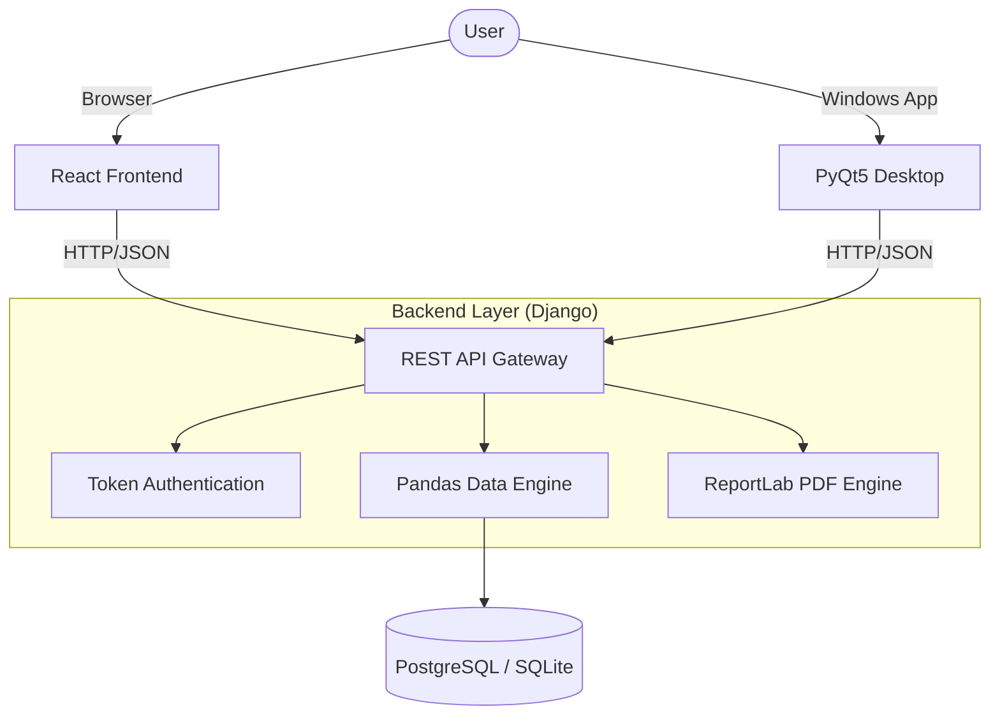

# 🧪 ChemViz: Chemical Equipment Parameter Visualizer

[](https://python.org)
[](https://djangoproject.com)
[](https://reactjs.org)
[](https://riverbankcomputing.com/software/pyqt/intro)
[](https://opensource.org/licenses/MIT)

A high-performance, hybrid analytics system designed for chemical engineers to visualize and process equipment parameter data. Features a **Django REST API**, an interactive **React Dashboard**, and a native **PyQt5 Desktop Application**.

### 🌍 Live Deployment
- **Web Application**: [https://chem-visualizer.onrender.com](https://chem-visualizer.onrender.com)
- **Backend API**: [https://chem-backend-2.onrender.com](https://chem-backend-2.onrender.com)

---

## 🏗️ System Architecture



---

## ✨ Key Features

### 🌐 Web Frontend (React)
- **Interactive Dashboards**: Real-time charts using `Chart.js`.
- **Responsive Tables**: Paginated equipment data with filtering.
- **Auto-Reports**: One-click PDF generation with statistical summaries.
- **Secure Auth**: JWT-style Token authentication for secure data access.

### 🖥️ Desktop Application (PyQt5)
- **Native Performance**: Fast, multi-threaded GUI with high-end dashboard styling.
- **Embedded Visuals**: Built-in `Matplotlib` charts for deep data analysis.
- **Standalone History**: View and download previous analysis reports locally.

### ⚙️ Shared Backend (Django & Pandas)
- **Intelligent Processing**: Automatically calculates Mean, Min, Max for Flowrate, Pressure, and Temperature.
- **Robust API**: RESTful endpoints with comprehensive error handling.
- **Production Ready**: Fully configured for Render with **Gunicorn** and **WhiteNoise**.

---

## � Workflow & Usage

### 1. The Core Workflow
1.  **Register/Login**: Authenticate via the Web or Desktop interface.
2.  **Data Ingestion**: Upload a `.csv` or `.xlsx` file containing chemical equipment parameters.
3.  **Processing**: The backend uses **Pandas** to calculate equipment type distributions and summary statistics.
4.  **Visualization**: View processed results through high-end charts (Bar, Pie, Trends).
5.  **Output**: Generate and download a formatted PDF report for documentation.

### 2. File Format Requirements
| Column | Type | Example |
| :--- | :--- | :--- |
| `Equipment Name` | String | Reactor-A |
| `Type` | Enum | Heat Exchanger, Pump, etc. |
| `Flowrate` | Float | 12.5 (m³/h) |
| `Pressure` | Float | 5.0 (bar) |
| `Temperature` | Float | 150.0 (°C) |

---

## 🛠️ Quick Start

### Backend (Django)
```bash
cd chemical-visualizer/backend
pip install -r requirements.txt
python manage.py migrate
python manage.py runserver
```

### Web Frontend (React)
```bash
cd chemical-visualizer/web-frontend
npm install
npm start
```

### Desktop App (PyQt5)
```bash
cd chemical-visualizer/desktop-frontend
pip install -r requirements.txt  # includes PyQt5, matplotlib, requests
python main.py
```

---

## 📤 API Reference

| Endpoint | Method | Description | Auth Required |
| :--- | :--- | :--- | :--- |
| `/api/register/` | `POST` | Create a new account | No |
| `/api/login/` | `POST` | Obtain Auth Token | No |
| `/api/upload/` | `POST` | Upload & Process CSV | **Yes** |
| `/api/history/` | `GET` | Get last 5 datasets | **Yes** |
| `/api/report/<id>/` | `GET` | Generate/Download PDF | **Yes** |

---

## 📦 Deployment (Render)

### Backend Settings
- **Build Command**: `./build.sh`
- **Start Command**: `gunicorn core.wsgi:application`
- **Envs**: `SECRET_KEY`, `DEBUG=False`, `DATABASE_URL`, `ALLOWED_HOSTS`

### Web Frontend Settings
- **Build Command**: `cd chemical-visualizer/web-frontend && npm install && npm run build`
- **Publish Dir**: `chemical-visualizer/web-frontend/build`
- **Envs**: `REACT_APP_API_URL=https://your-backend.onrender.com/api`

---

> [!TIP]
> Use the included `sample_equipment_data.csv` for an immediate end-to-end test of the visualization engine.
